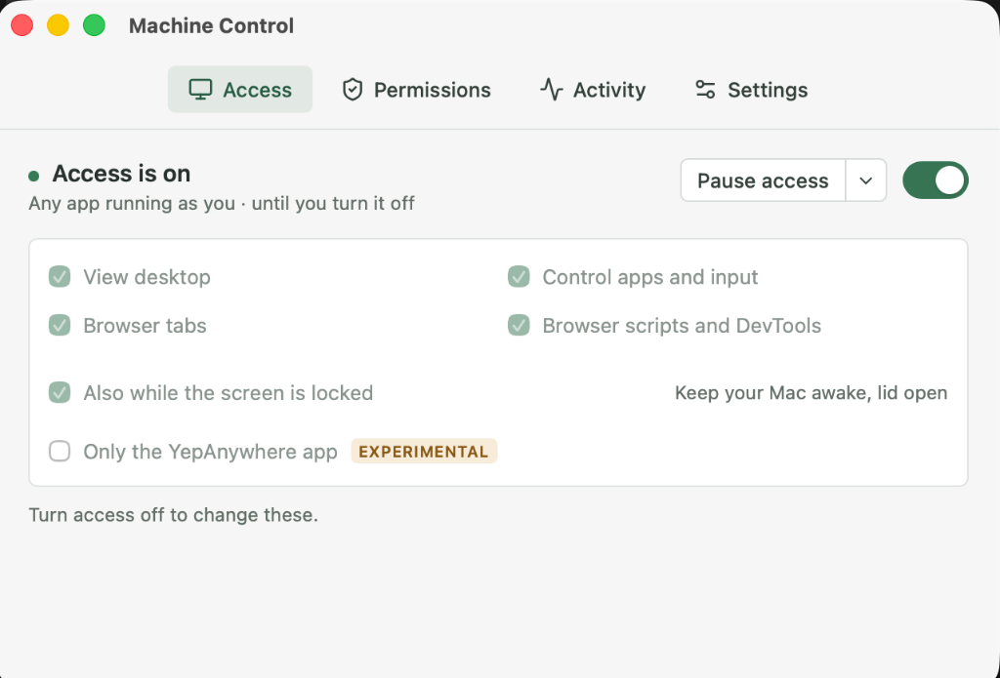

# Machine Control

**Let AI agents use your computers and devices—with access you control.**

Machine Control is a desktop app for macOS, Windows, and Linux that gives
agents access to applications, browser tabs, screenshots, keyboard, and mouse.
Choose what they can access, pause control, and review activity. It also
provides a CLI for automation and remote targets, including physical iPhones,
Chromebooks, Android devices, and more.

[Download](https://machinecontrol.dev/downloads/) ·
[Desktop guide](desktop/README.md) · [CLI guide](docs/cli-guide.md) ·
[Device setup](platforms/README.md)



*Machine Control on macOS. Choose access scopes and pause control at any time.*

## What you can do

- **Use desktop applications:** inspect windows and UI elements, click controls,
  enter text, and capture screenshots.
- **Control the browser:** inspect and operate tabs through the optional Chrome
  extension, with separate access for browser scripts and DevTools.
- **Work with real devices:** install and exercise apps on a physical iPhone,
  operate a Chromebook's desktop and browser, or deploy to Android and Quest.
- **Test locally or remotely:** drive your own computer, a VM, or a configured
  physical device from the agent's existing session.
- **Keep access visible:** select scopes and duration in the desktop app, pause
  supported control sessions, stop access, and inspect activity.

Available controls depend on the platform and selected permissions. Machine
Control combines native UI information with screenshots and input, so agents
can inspect what a button means as well as where it appears.

## Get the desktop app

[Download for Mac, Windows, or Linux](https://machinecontrol.dev/downloads/).
The app includes the control CLI and its Python runtime; using the installed
CLI does not require a source checkout or a separate Python installation.

1. Install and open Machine Control.
2. Follow Permissions to enable the platform's required access and optional
   browser integration.
3. Choose access scopes and duration, or approve an agent's request.

The app runs in the menu bar or tray. Closing its settings window keeps it
running; Quit ends it. Access starts off, and you can stop it from the app.
Grants normally apply to callers running as your user; an agent with an
unrestricted shell under that same account is not contained by those grants.
See [security and authorization](SECURITY.md) for the boundaries.

## What works today

**Current:** desktop packages are available for both architectures on all three
platforms. The app is actively used and developed; the release remains
pre-1.0, and testing coverage varies by platform and environment.

| Platform | Desktop app availability |
| --- | --- |
| macOS | Apple silicon and Intel; native app control, capture/input, browser integration, and signed updates. Recorded execution coverage is strongest on Apple silicon. |
| Windows | x64 and ARM64; native app control, capture/input, browser integration, and signed updates, with installed GUI acceptance on both architectures. Optional UAC and locked-screen helpers require separate setup. |
| Linux | x64 and ARM64 Debian/AppImage packages for Ubuntu GNOME Wayland. App control uses accessibility; screen/input sharing uses visible portal consent. Broader Linux desktops remain open. |

The [desktop acceptance matrix](docs/desktop-acceptance.md) records exact
package, architecture, VM, and physical-machine coverage. Setup and feature
limits live in the [desktop guide](desktop/README.md) and
[Linux installation guide](desktop/LINUX.md). Release changes live in the
[changelog](desktop/CHANGELOG.md).

## Physical devices and remote targets

Machine Control also works beyond the computer running the desktop app.
These routes use platform-specific setup and native runners through the common
CLI; they are not additional desktop app installers.

- **[Physical iOS devices](platforms/ios/README.md):** control a real iPhone
  from an authorized Mac using CoreDevice and XCTest. Install and launch apps,
  inspect and act on UI elements, take screenshots, and collect app/system logs,
  crash reports, and app-container files. Developer Mode, pairing, and runner
  signing are part of setup; protected authentication retains its native limits.
- **[ChromeOS](platforms/chromeos/README.md):** control a dedicated
  developer-mode Chromebook's desktop accessibility tree, browser tabs,
  screenshots, and input remotely, with the controls running on the Chromebook.
- **[Android](platforms/android/README.md) and
  [Quest](platforms/quest/README.md):** native device discovery, deployment,
  lifecycle, capture/input, and diagnostics through their ADB-based routes.
- **[Steam Deck](platforms/steamdeck/README.md):** device administration and
  session-aware native operations.

For desktop VMs and remote computers, see the
[platform guides](platforms/README.md) and
[controller-host support](docs/controller-host-support.md). Ordinary VM control
runs inside the guest and does not require focusing its hypervisor window.

## Command-line automation

The CLI supports desktop operations, physical devices, remote targets, and
headless deployments. From a source checkout, start with read-only discovery:

```bash
git clone https://github.com/kzahel/machine-control.git
cd machine-control
bin/machine-control targets
```

On Windows, use `py -3 bin/machine-control targets`. The source client requires
Python 3.10 or later. Follow the [CLI guide](docs/cli-guide.md) for target setup,
desktop and iOS examples, scoped tasks, and VM workspaces. Before operating an
accepted VM, run its read-only doctor and acquire an exclusive target-use claim;
scoped tasks manage claim renewal and cleanup.

## North Star

**Decision:** an authorized agent should be able to select a supported computer
or device and use its richest practical native controls, whether the agent runs
locally or elsewhere. Desktop control executes in the target OS; constrained
devices use their strongest native runner and authorized device host. Another
agent inside the target is optional. Hypervisor consoles and external KVM/input
are explicit bootstrap and recovery routes.

The project owns a common control experience over replaceable providers, while
preserving platform capabilities and limits. Results distinguish action delivery
from observed effects. See [architecture](topics/architecture.md),
[inner-first routing](topics/inner-first-routing.md), and
[capabilities and results](topics/capabilities-and-results.md).

## Documentation and development

- [Desktop guide](desktop/README.md): setup, permissions, platform boundaries,
  and building the app.
- [CLI guide](docs/cli-guide.md) and [target configuration](docs/target-registry.md):
  local/remote operation and private inventory.
- [Platform guides](platforms/README.md): native setup, lifecycle, and recovery.
- [Topics](topics/README.md): current decisions, status, and remaining work.
- [Research](research/README.md): provider comparisons and evidence.
- [Contracts](contracts/README.md), [glossary](GLOSSARY.md), and
  [system map](SYSTEM-MAP.md): interface guarantees, vocabulary, and ownership.
- [Execution records](docs/tactical/README.md) and
  [release process](release/desktop.md): implementation and publication detail.

Run `python3 bin/check --portable` for dependency-light checks that do not contact
configured targets. Use `python3 bin/check --native` for applicable platform
builds and static validation; deeper suites are in the platform guides and
[client tests](tests/client/README.md).

## License

[MIT](LICENSE).
